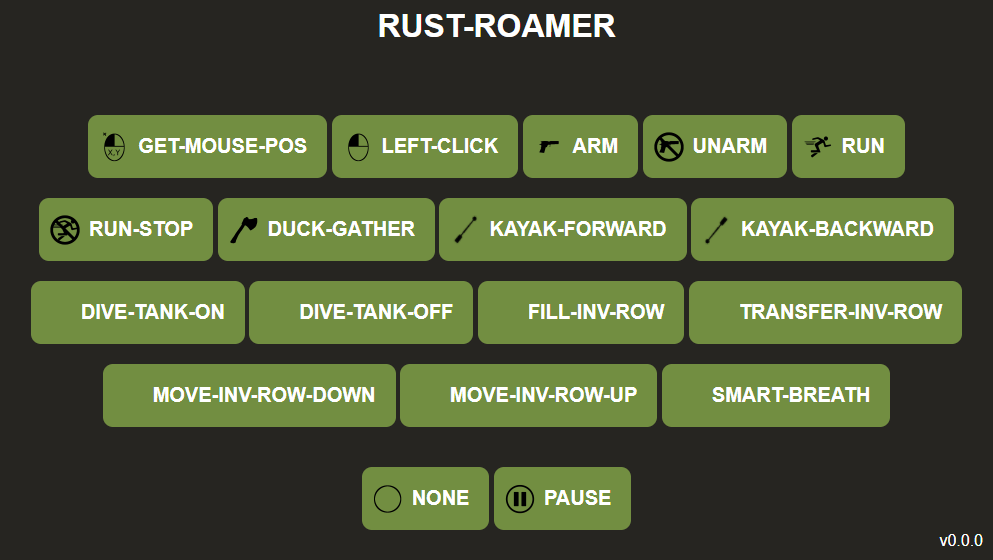
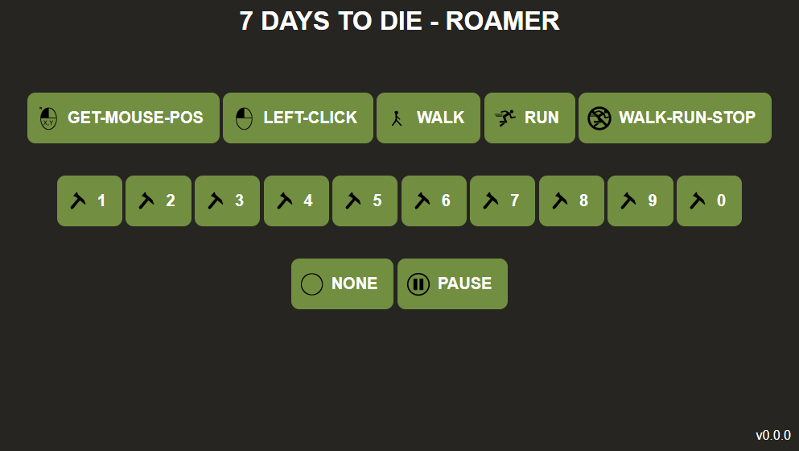

# rust-roamer

Demo Project how to automate windows keyboard/mouse interactions through a web frontend.

**Attention**
* Read and understand the source code before using this tool
* Some of those tasks require special preparation
* Ensure to execute any of the following actions only with windows focused on the appropriate game.

This Currently automates boring tasks like

### rust

* run
* paddle kayak
* left clicking
* mouse pos investigation
* arm first inventory row
* unarm items
* fill up an inventory row
* transfer inventory row
* move inventory row up
* smart breath
* dive tank on/off

### seven days to die

* left clicking
* walk
* run
* repair slot (1-10)

**Screenshots**

To give some impression how it looks like

