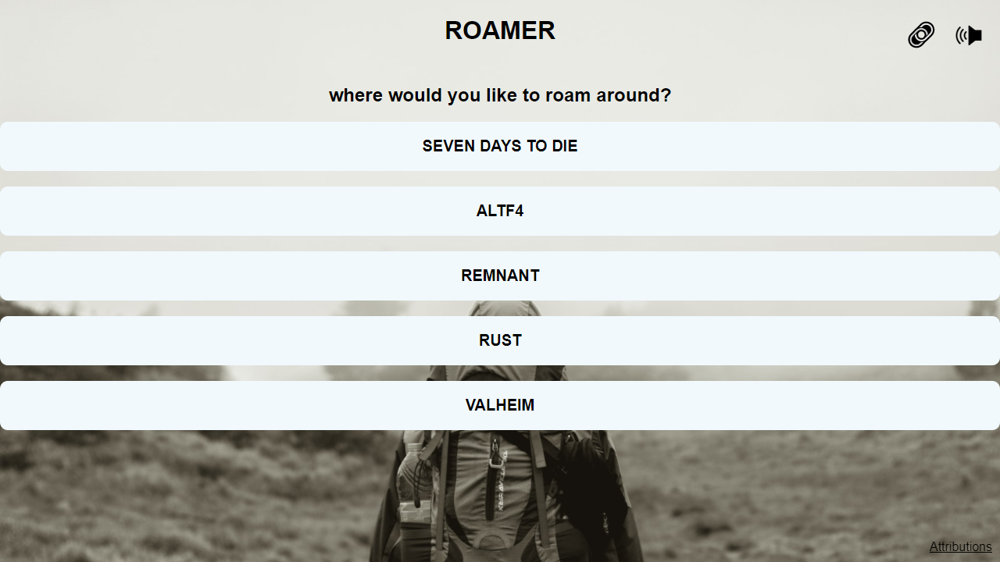
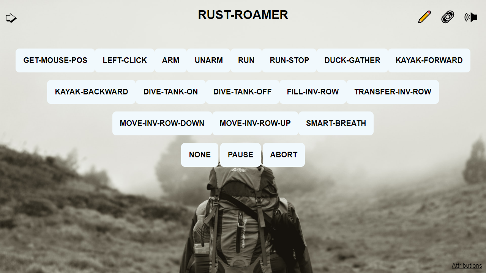
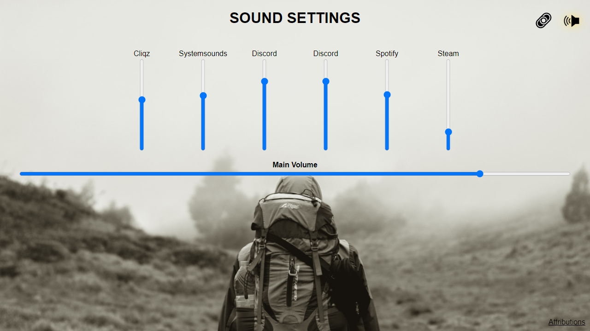
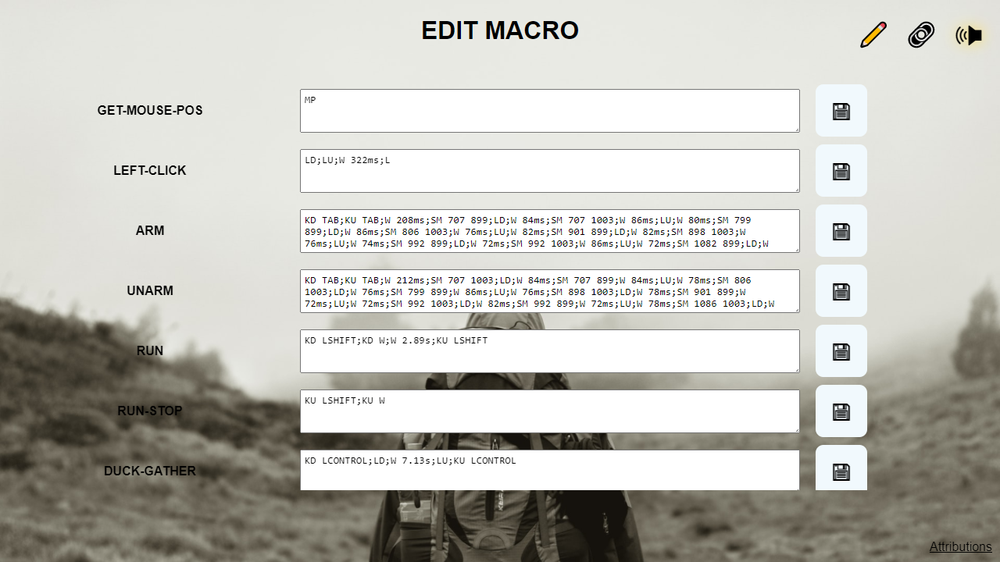

# roamer

Demo Project how to automate Windows keyboard/mouse interactions through a web frontend.

* Webservice (HTTP, Websockets) [go]
* Webfrontend [Vue.js]

The webservice uses  **Win32 API** for simulating
keyboard and mouse events and **Windows Core Audio API** for sound settings.

**Attention**

* Read and understand the source code before using this tool
* Some of those tasks require special preparation
* Ensure to execute any of the following actions only with windows focused on the appropriate game.

## Screens

This default configruation brings some samples for some games.

### rust

* run
* paddle kayak
* left-clicking
* mouse pos investigation
* arm first inventory row
* unarm items
* fill up an inventory row
* transfer inventory row
* move inventory row up
* smart breath
* dive tank on/off

### seven days to die

* left-clicking
* walk
* run
* repair slot (1-10)

### altf4

* attempt for a full run
* several sequences to jump the first hurdles

### valheim

* walk
* run
* grillmaster

---
**Attributions:**  
Background
Image: [aliffian arief](https://unsplash.com/@helip?utm_source=unsplash&utm_medium=referral&utm_content=creditCopyTex)
