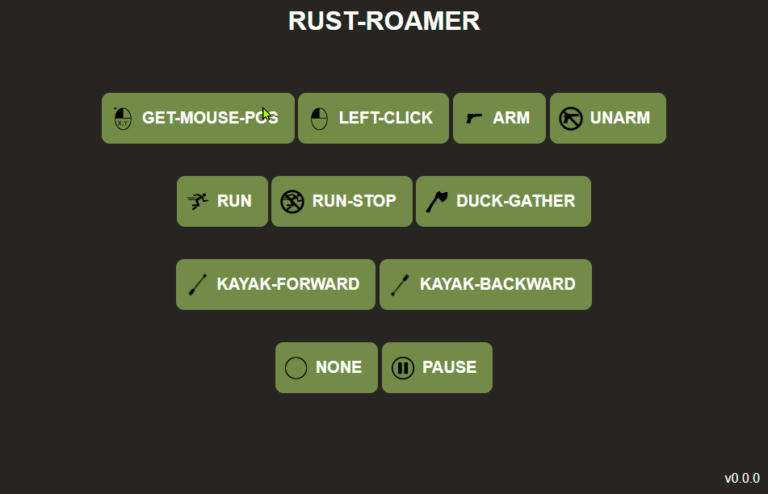

# rust-roamer

Demo Project how to automate keyboard interactions through a web frontend.

**This Currently automates boring tasks like** 
* run 
* paddle kayak
* left clicking
* mouse pos investigation
* arm first inventory row
* unarm items

**Screenshot**
